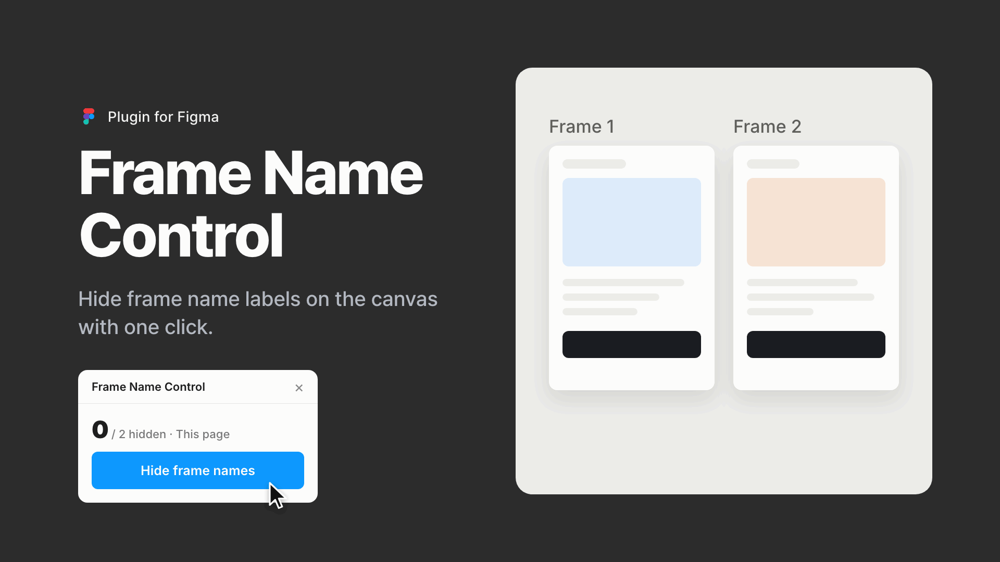

# Frame Name Control

[English](README.md)

캔버스에 떠 있는 프레임 이름 라벨을 단축키 하나로 껐다 켜는 Figma용 무료 플러그인입니다.



프레임 이름 라벨은 프레임을 찾을 때 유용하지만, 레이아웃을 검토하거나 화면을 공유할 때는 캔버스를 어지럽힙니다. Frame Name Control을 쓰면 키 하나로 라벨을 숨기고, 같은 키로 다시 켤 수 있습니다. 메뉴 명령 이름이 바뀌지 않으므로 macOS 단축키를 붙일 수 있습니다.

## 설치

**Figma Community**: 곧 올라갑니다. Figma가 승인하면 이곳에 링크를 올립니다.

**소스에서 설치**

1. 이 저장소를 내려받아(**Code → Download ZIP**) 압축을 풉니다.
2. Figma 데스크톱 앱에서 디자인 파일을 아무거나 엽니다.
3. **Plugins → Development → Import plugin from manifest…** 메뉴를 고르고 `manifest.json`을 선택합니다.

한 번만 불러오면 모든 파일에서 쓸 수 있습니다. 처음 명령을 실행하면 이름을 바로 바꾸지 않고 플러그인 창을 먼저 열어, 이름을 어떻게 바꾸는지 보여 줍니다.

**Widgets** 메뉴가 아니라 **Plugins** 메뉴로 불러와야 합니다. Widgets 메뉴로 불러오면 아래 에러가 납니다.

```
Manifest error: Expected "manifest.containsWidget" to have type true but got undefined instead
```

## 단축키 지정 (macOS)

1. **시스템 설정 → 키보드 → 키보드 단축키… → 앱 단축키**를 엽니다.
2. **+ 버튼**을 누르고 응용 프로그램에서 **Figma**를 고른 뒤, 메뉴 제목에 `Toggle Frame Names`를 똑같이 입력합니다.
3. 키보드 단축키 칸을 누르고 **⌥⌘F**를 누른 다음 **완료**를 누릅니다.
4. Figma를 **⌘Q**로 종료했다가 다시 엽니다.

⌥⌘F는 한 손으로 누르기 어렵습니다. **오른손으로 키보드 오른쪽의 ⌘⌥를 누른 채 왼손으로 F**를 누르면 편합니다.

터미널로 등록할 수도 있습니다.

```bash
./scripts/set-shortcut.sh cmd+opt+f     # 지정
./scripts/set-shortcut.sh --list        # 확인
./scripts/set-shortcut.sh --remove      # 해제
```

### ⌘가 필요한 이유

⇧F 같은 조합도 등록은 되고 메뉴에도 표시되지만, 눌러도 동작하지 않습니다. ⌘가 없는 키는 메뉴보다 Figma 캔버스가 먼저 받아 처리합니다. 한글로 입력하는 중이라면 입력기가 키를 먼저 글자로 바꾸기도 합니다. ⌘가 들어간 조합은 이 두 단계에 걸리지 않으므로, Figma가 이미 쓰는 조합만 아니면 동작합니다.

Figma가 이미 쓰는 ⌘F(Find)와 ⇧⌘F(Find Next), macOS가 "다른 항목 가리기"로 쓰는 ⌥⌘H는 피하세요. ⌥⌘F는 비어 있습니다.

### 설정 없이 쓰기

플러그인을 한 번 실행한 뒤 **⌥⌘P**(마지막 플러그인 다시 실행)를 누르세요. 다른 플러그인을 실행하기 전까지는 ⌥⌘P가 토글 키가 됩니다.

### Windows

앱 단축키는 macOS 기능입니다. Windows에서는 플러그인을 한 번 실행한 뒤 **Ctrl+Alt+P**로 다시 실행하세요.

## 명령

| 메뉴 | 하는 일 |
| --- | --- |
| Toggle Frame Names | 이름을 숨기고, 숨겨져 있으면 되돌립니다. 단축키를 붙이는 명령입니다. |
| Hide Frame Name Labels | 설정한 범위의 이름을 숨깁니다. |
| Show Frame Name Labels | 설정한 범위의 이름을 되돌립니다. |
| Restore All Frame Names | 범위와 상관없이 모든 페이지의 이름을 되돌립니다. |
| Frame Name Settings | 플러그인 창을 엽니다. |

## 설정

- **적용 범위**: 이 페이지 / 모든 페이지 / 선택한 레이어
- **언어**: 자동 / English / 한국어

설정은 사용자별로 저장되므로 다른 파일을 열어도 그대로입니다.

## 동작 방식과 한계

Figma 플러그인 API로는 캔버스 라벨을 끌 수 없습니다. 그래서 이 플러그인은 프레임 이름을 눈에 보이지 않는 문자 `U+2800`(Braille Pattern Blank)으로 바꾸고, 원래 이름은 레이어의 plugin data에 보관합니다. plugin data는 파일에 함께 저장되므로 파일을 닫았다 다시 열어도 이름을 되돌릴 수 있습니다.

이 방식에는 한계가 있습니다.

- **레이어 패널에서도 이름이 비어 보입니다.** 캔버스 라벨만 따로 숨길 수는 없습니다.
- **같은 파일을 보는 동료에게도 보입니다.** 이름을 바꾸면 파일이 실제로 바뀝니다.
- **실행할 때마다 되돌리기 기록이 한 칸 쌓입니다.** ⌘Z나 버전 기록으로 되돌릴 수 있습니다.
- **인스턴스와 다른 프레임 안의 프레임은 이름을 바꾸지 않습니다.** 인스턴스 이름을 바꾸면 메인 컴포넌트 이름을 따라가던 연결이 끊어지고, 다른 프레임 안의 프레임은 원래 캔버스에 라벨이 보이지 않습니다.
- **배리언트 컴포넌트는 이름을 바꾸지 않습니다.** `Property=Value` 형식의 이름이 곧 배리언트 속성이기 때문입니다.

숨긴 상태에서 레이어 이름을 직접 새로 붙였다면, 되돌릴 때 그 이름을 그대로 둡니다.

## 문제 해결

**단축키가 동작하지 않을 때**

1. `./scripts/set-shortcut.sh --list`로 제목이 `Toggle Frame Names`와 똑같은지 확인합니다.
2. Figma를 **⌘Q**로 종료했다가 다시 엽니다. 창만 닫으면 적용되지 않습니다.
3. **Plugins** 메뉴에서 **Frame Name Control**을 찾아 `Toggle Frame Names` 오른쪽에 단축키가 표시되는지 봅니다. 표시되지 않으면 Figma가 아직 새 설정을 읽지 않은 것입니다.
4. 표시되는데도 동작하지 않으면 조합에 **⌘ 키**가 들어 있는지 확인합니다.

## 개발

```
manifest.json            플러그인 정의와 메뉴 명령
code.js                  숨김·복구 로직 (빌드 단계 없음)
ui.html                  플러그인 창
scripts/set-shortcut.sh  macOS 앱 단축키 등록
test/logic.test.js       숨김·복구 로직 테스트
assets/                  Figma Community 아이콘, 커버 이미지, GIF, 동영상
```

TypeScript도 번들러도 쓰지 않습니다. 파일을 고친 뒤 Figma에서 **Plugins → Development → Hot reload plugin**을 누르면 바로 적용됩니다.

테스트는 Figma API를 흉내 낸 가짜 객체 위에서 `code.js`를 실행합니다.

```bash
node test/logic.test.js
```

아이콘과 커버는 `assets/src`의 HTML 파일로 만듭니다. 다시 만들려면 Google Chrome, Pillow, ffmpeg가 필요합니다.

```bash
python3 assets/src/build.py
```

## 피드백

버그를 찾았거나 아이디어가 있다면 플러그인 창 아래쪽의 **피드백 보내기**를 누르거나 [피드백 설문](https://docs.google.com/forms/d/e/1FAIpQLSeSW8T6jTH7-0Vgd6DsBZE14iGYCRsVAxkcF2ton4zTk7KvVA/viewform)을 남겨 주세요. 계정이 없어도 됩니다.

## 만든 사람

Belle Kim · [LinkedIn](https://www.linkedin.com/in/belleyejinkim/)

## 라이선스

[MIT](LICENSE) © Belle Kim
