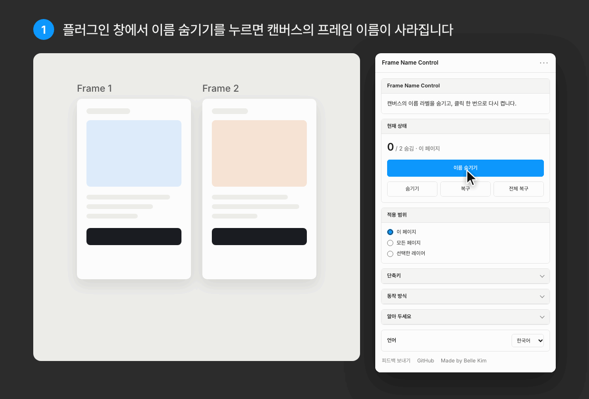
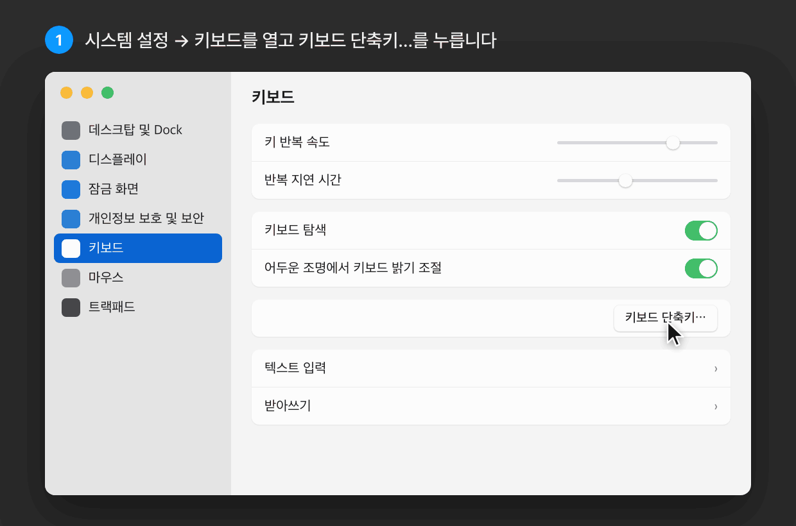

# Frame Name Control

[English](README.md)

캔버스에 떠 있는 프레임 이름 라벨을 클릭 한 번으로, 또는 직접 지정한 단축키로 껐다 켜는 Figma용 무료 플러그인입니다.


프레임 이름 라벨은 프레임을 찾을 때 유용하지만, 레이아웃을 검토하거나 화면을 공유할 때는 캔버스를 어지럽힙니다. Frame Name Control을 쓰면 클릭 한 번으로 라벨을 숨기고, 다시 한 번 눌러 켤 수 있습니다. 따로 설정할 것은 없습니다.

## 설치

[Figma 데스크톱 앱](https://www.figma.com/downloads/)이 필요합니다.

### AI에게 설치 맡기기

내 컴퓨터에 파일을 저장하거나 명령을 실행할 수 있는 AI 앱에 아래 프롬프트를 복사해서 붙여 넣으세요.

```text
내 컴퓨터에 Figma 플러그인 Frame Name Control을 설치해줘.
저장소: https://github.com/belleyejinkim/figma-frame-control

내 운영체제를 확인한 뒤, https://raw.githubusercontent.com/belleyejinkim/figma-frame-control/main/ 에서 manifest.json, code.js, ui.html을 내 홈 폴더의 FigmaPlugins/figma-frame-control에 내려받아줘. macOS에서는 저장소의 install.sh를 실행해도 되고, Windows에서는 Git Bash를 설치하지 않고 PowerShell로 파일을 내려받아도 돼.

파일 3개가 비어 있지 않고, manifest.json의 main과 ui가 내려받은 파일을 가리키는지 확인해줘. manifest.json의 절대경로도 알려줘.

Figma 데스크톱 앱을 조작할 수 있으면 Plugins > Development > Import plugin from manifest… 메뉴로 이 파일을 불러와 플러그인을 등록해줘. 직접 조작할 수 없으면 내가 최초 등록을 할 수 있게 쉬운 말로 안내해줘. 내 컴퓨터의 파일에 접근할 수 없다면, 설치를 완료하려면 어떤 접근 기능이 필요한지 알려줘.
```

### 명령어 한 줄로 설치

**macOS는 터미널**, **Windows는 Git Bash**에서 아래 한 줄을 실행하세요.

```sh
curl -fsSL https://raw.githubusercontent.com/belleyejinkim/figma-frame-control/main/install.sh | sh
```

플러그인에 필요한 파일 3개를 `~/FigmaPlugins/figma-frame-control`에 설치합니다. Git이나 Node.js, 빌드 과정은 필요 없습니다. 업데이트할 때도 같은 명령어를 실행하세요. 실행 전에 [설치 스크립트](install.sh)를 확인할 수 있습니다.

**Figma에서 최초 한 번 등록:** 명령어로 파일을 설치한 뒤, Figma에서 [플러그인을 불러와](https://help.figma.com/hc/en-us/articles/360042786733-Create-a-classic-plugin-for-development) 등록해야 합니다.

1. Figma 데스크톱 앱에서 디자인 파일을 아무거나 엽니다.
2. **Plugins → Development → Import plugin from manifest…** 메뉴를 고르고, 설치 명령이 출력한 폴더의 `manifest.json`을 선택합니다. **Plugins** 메뉴를 사용하세요.
3. **Plugins → Development → Frame Name Control → Open**을 열고 **이름 숨기기**를 누릅니다.

한 번 등록하면 모든 파일에서 쓸 수 있습니다. Figma가 파일을 읽을 수 있도록 설치 폴더를 그대로 두세요. 업데이트 후에는 다시 등록할 필요가 없습니다.

## 사용 방법

1. 플러그인을 열고 **이름 숨기기**를 누르면 캔버스의 프레임 이름이 사라집니다.
2. 버튼을 다시 누르면 이름이 돌아옵니다.
3. **적용 범위**로 이 페이지, 모든 페이지, 선택한 레이어 중에서 고릅니다.

같은 동작을 **Plugins → Development → Frame Name Control** 메뉴에서도 실행할 수 있습니다. **Open**을 제외한 명령은 첫 실행 때 이름을 어떻게 바꾸는지 창에서 보여 주고, 이후에는 창 없이 동작합니다.

| 메뉴 | 하는 일 |
| --- | --- |
| Open | 플러그인 창을 엽니다. |
| Toggle Frame Names | 이름을 숨기고, 숨겨져 있으면 되돌립니다. |
| Hide Frame Name Labels | 설정한 범위의 이름을 숨깁니다. |
| Show Frame Name Labels | 설정한 범위의 이름을 되돌립니다. |
| Restore All Frame Names | 범위와 상관없이 모든 페이지의 이름을 되돌립니다. |



### 단축키 (macOS, 선택)

Figma는 플러그인에 단축키를 줄 수 없지만, macOS는 메뉴 항목에 단축키를 붙일 수 있습니다. 컴퓨터마다 한 번, 1분이면 끝납니다.

1. **시스템 설정 → 키보드**를 열고 **키보드 단축키…** 버튼을 누릅니다.
2. 왼쪽에서 **앱 단축키**를 고르고 **+** 버튼을 누릅니다.
3. 응용 프로그램에서 **Figma**를 고르고, 메뉴 제목에 `Toggle Frame Names`를 입력합니다. 글자가 정확히 같아야 하니 플러그인 창의 복사 버튼을 쓰는 편이 안전합니다.
4. 키보드 단축키 칸을 누르고 **⌥⌘F**를 누른 다음 **완료**를 누릅니다.
5. Figma를 **⌘Q**로 종료했다가 다시 엽니다.

이제 Figma 어디서나 **⌥⌘F**로 프레임 이름을 껐다 켤 수 있습니다. **⌘ 키**가 들어가고 Figma가 쓰지 않는 조합이면 무엇이든 됩니다. ⌘F와 ⇧⌘F는 이미 쓰입니다. Windows에서는 오른쪽 패널 버튼을 쓰세요.



## 설정

- **적용 범위**: 이 페이지 / 모든 페이지 / 선택한 레이어
- **언어**: 자동 / English / 한국어

설정은 사용자별로 저장되므로 다른 파일을 열어도 그대로입니다.

## 동작 방식과 한계

Figma 플러그인 API로는 캔버스 라벨을 끌 수 없습니다. 그래서 이 플러그인은 프레임 이름을 눈에 보이지 않는 문자 `U+2800`(Braille Pattern Blank)으로 바꾸고, 원래 이름은 레이어의 plugin data에 보관합니다. plugin data는 파일에 함께 저장되므로 파일을 닫았다 다시 열어도 이름을 되돌릴 수 있습니다.

이 방식에는 한계가 있습니다.

- **레이어 패널에서도 이름이 비어 보입니다.** 캔버스 라벨만 따로 숨길 수는 없습니다.
- **같은 파일을 보는 동료에게도 보입니다.** 이름을 바꾸면 파일이 실제로 바뀝니다.
- **실행할 때마다 되돌리기 기록이 한 칸 쌓입니다.** ⌘Z나 버전 기록으로 되돌릴 수 있습니다.
- **캔버스에 이름이 보이는 프레임만 바꿉니다.** Figma는 캔버스에 바로 놓인 [상위 프레임](https://help.figma.com/hc/en-us/articles/360041539473-Frames-in-Figma-Design)에만 이름을 보여 주고, 섹션 안에 놓인 프레임도 이름이 보입니다. 다른 프레임이나 그룹 안의 프레임, 섹션, 컴포넌트, 배리언트, 인스턴스는 이름을 그대로 둡니다. 컴포넌트 이름을 바꾸면 인스턴스에 보이는 이름까지 바뀌기 때문에 컴포넌트는 건드리지 않습니다.

숨긴 상태에서 레이어 이름을 직접 새로 붙였다면, 되돌릴 때 그 이름을 그대로 둡니다.

## 피드백

버그를 찾았거나 아이디어가 있다면 플러그인 창 아래쪽의 **피드백 보내기**를 누르거나 [피드백 설문](https://docs.google.com/forms/d/e/1FAIpQLSeSW8T6jTH7-0Vgd6DsBZE14iGYCRsVAxkcF2ton4zTk7KvVA/viewform)을 남겨 주세요. 계정이 없어도 됩니다.

## 만든 사람

Belle Kim · [LinkedIn](https://www.linkedin.com/in/belleyejinkim/)

## 라이선스

[MIT](LICENSE) © Belle Kim
