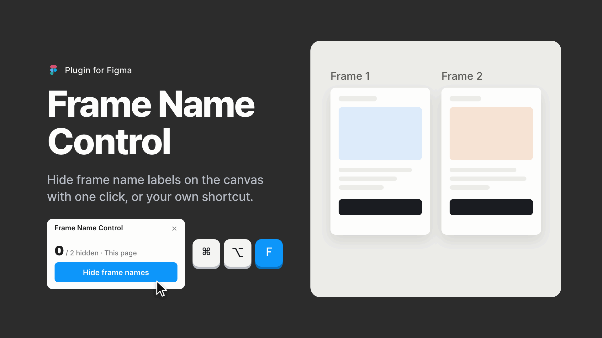
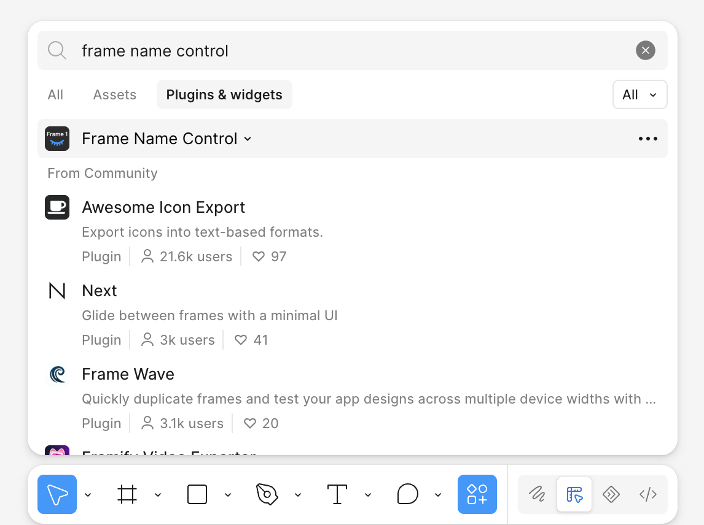
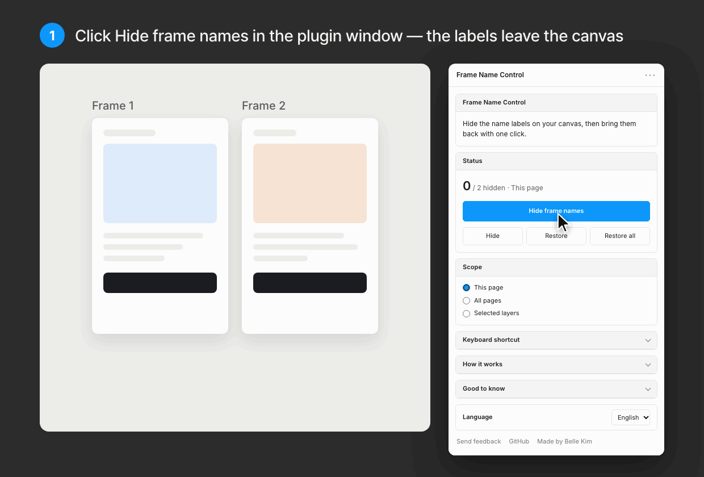
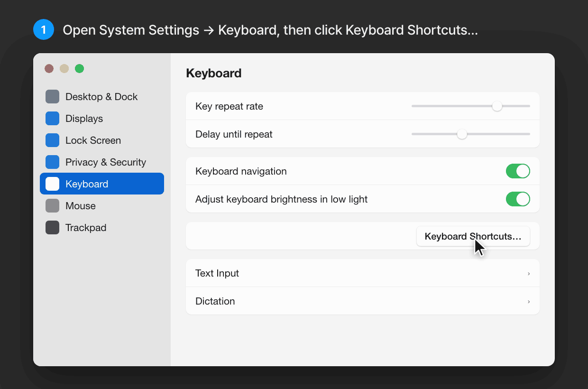

# Frame Name Control

[한국어](README.ko.md)

Frame Name Control is a free plugin for Figma that hides the frame name labels on the canvas and brings them back with one click, or with a keyboard shortcut you set up once.



Name labels help you find frames, but they clutter the canvas when you review a layout or share your screen. With Frame Name Control, one click clears them and another brings them back. There's nothing to set up.

## Install

### From Figma Community

Frame Name Control is now available on **Figma Community**. You can find and open it directly in Figma.

1. Open any Figma Design file.
2. Click **Actions** in the toolbar, or press **⌘K** on macOS (**Ctrl+K** on Windows).
3. Choose **Plugins & widgets** and search for `Frame Name Control`.
4. Select **Frame Name Control** and choose **Open**.



### Ask AI to install

Copy this prompt into your AI assistant. It can help you set up the plugin in Figma or guide you through the steps:

```text
Help me install Frame Name Control from Figma Community.
Repository: https://github.com/belleyejinkim/figma-frame-control

In a Figma Design file, open Actions > Plugins & widgets, search for Frame Name Control, select the plugin, and choose Open.

If you can control Figma, do those steps for me. Otherwise, guide me in simple language. Use the Community version by default; it does not require downloading source files or importing a manifest.

If I ask for a source installation instead, follow the repository's one-line installation instructions, verify the downloaded plugin files, and show me the absolute path to manifest.json and how to import it in the Figma desktop app.
```

### From source (one command)

To try local changes, install the source version with the [Figma desktop app](https://www.figma.com/downloads/).

Run this one line in **Terminal on macOS** or **Git Bash on Windows**:

```sh
curl -fsSL https://raw.githubusercontent.com/belleyejinkim/figma-frame-control/main/install.sh | sh
```

This downloads the three plugin files to `~/FigmaPlugins/figma-frame-control`. No Git, Node.js, or build step is needed. Run the same command again to update. You can [read the installer](install.sh) before running it.

**One-time setup for the source version:** the command installs the files; [import the plugin](https://help.figma.com/hc/en-us/articles/360042786733-Create-a-classic-plugin-for-development) once to register it in Figma.

1. Open any design file in the Figma desktop app.
2. Choose **Plugins → Development → Import plugin from manifest…** and select `manifest.json` from the folder printed by the installer. Use the **Plugins** menu.
3. Run **Plugins → Development → Frame Name Control → Open** and click **Hide frame names**.

Once imported, the plugin is available in every file. Keep the installed folder in place so Figma can load it. Updating the files does not require another import.

## How to use

1. Open the plugin and click **Hide frame names** to hide the canvas labels.
2. Click the button again to restore the names.
3. **Scope** decides what changes: this page, all pages, or the layers you selected.

The same actions are available in the dropdown beside **Frame Name Control** in **Actions → Plugins & widgets**. Commands other than **Open** show the plugin window on their first run so you can read how names change, then work without it.

| Menu | What it does |
| --- | --- |
| Open | Opens the plugin window. |
| Toggle Frame Names | Hides names, or restores them if they're hidden. |
| Hide Frame Name Labels | Hides names in the current scope. |
| Show Frame Name Labels | Restores names in the current scope. |
| Restore All Frame Names | Restores names on every page, whatever the scope. |



### Keyboard shortcut (macOS, optional)

Figma can't give plugins a shortcut, but macOS can bind one to any menu item. It takes a minute, once per computer.

1. Open **System Settings → Keyboard**, then click **Keyboard Shortcuts…**
2. Pick **App Shortcuts** on the left, then click **+**.
3. Choose **Figma**, and enter `Toggle Frame Names` as the menu title. It has to match exactly, so copy it from the plugin window.
4. Click the shortcut field, press **⌥⌘F**, then click **Done**.
5. Quit Figma with **⌘Q** and open it again.

Now **⌥⌘F** hides and shows frame names from anywhere in Figma. Any combination works as long as it includes **⌘** and Figma doesn't already use it; ⌘F and ⇧⌘F are taken. On Windows, use the button in the right panel.



## Settings

- **Scope**: this page, all pages, or selected layers
- **Language**: auto, English, or Korean

Figma saves your settings per user, so they follow you from file to file.

## How it works

Figma's plugin API can't switch off canvas labels. Instead, the plugin renames each frame to an invisible character, `U+2800` (Braille Pattern Blank), and stores the original name in the layer's plugin data. Plugin data is saved with the file, so names come back even after you close and reopen it.

This approach has side effects:

- **Names look blank in the Layers panel too.** The plugin can't hide the canvas label alone.
- **Collaborators see the change.** Renaming a layer edits the file.
- **Each run adds one undo step.** ⌘Z brings the names back, and version history is a safe fallback.
- **Only frames whose names show on the canvas change.** Figma shows names only for [top-level frames](https://help.figma.com/hc/en-us/articles/360041539473-Frames-in-Figma-Design), which sit directly on the canvas, and frames placed in a section show theirs too. Frames inside other frames or groups, sections, components, variants, and instances keep their names. Renaming a component would also change the names its instances show, so components are left alone.

If you rename a layer while its name is hidden, the plugin keeps your new name when it restores the others.

## Feedback

Found a bug or have an idea? Choose **Send feedback** at the bottom of the plugin window, or [fill out the feedback form](https://docs.google.com/forms/d/e/1FAIpQLSeSW8T6jTH7-0Vgd6DsBZE14iGYCRsVAxkcF2ton4zTk7KvVA/viewform). No account needed.

## Author

Made by Belle Kim · [LinkedIn](https://www.linkedin.com/in/belleyejinkim/)

## License

[MIT](LICENSE) © Belle Kim
